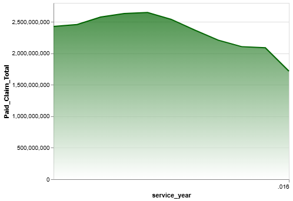

# NY Mental Health Expenditure Analysis

## Overview
This project analyzes county-level mental health expenditure data across New York State to uncover patterns in resource distribution.  
The analysis highlights disparities in spending and identifies areas where funding allocation may be misaligned with need.

---

## Key Insights
- Coastal counties with large population centers show higher per capita mental health spending compared to more rural regions  
- Overall mental health expenditure trends declined across New York State between 2006–2016  
- Clinic-based treatment accounts for a larger share of spending than inpatient care, contrary to common assumptions  

---

## Visualizations

### County-Level Expenditure Map
*Note: The interactive map does not render on GitHub. A static version is shown below.*
<p align="center">
  
</p>
*Figure 1: County-level mental health expenditure across New York State*

### Spending Trends Over Time
<p align="center">
  
</p>
*Figure 2: Mental health spending trends in New York (2006–2016)*

---

## Tools & Technologies
- Python (pandas, geopandas, folium, altair, matplotlib, numpy)  
- Jupyter Notebook  

---

## How to Run

1. Clone this repository
2. Install the required packages with:

```bash
pip install -r requirements.txt
```
3. Open the notebook and run the cells in order

## Notebook

The full analysis can be viewed here:

[View Notebook](notebooks/portfolio_project_CH.ipynb)
