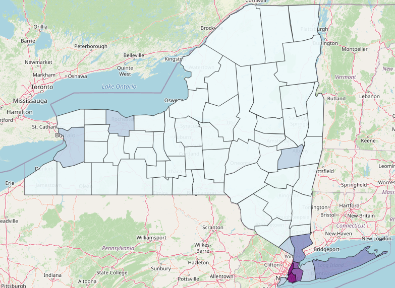

# NY Mental Health Expenditure Analysis

## Overview
This project analyzes county-level mental health expenditure data across New York State to uncover patterns in resource distribution.  
The analysis highlights disparities in spending and identifies areas where funding allocation may be misaligned with need.

---

## Key Insights
- Coastal counties with large population centers show higher per capita mental health spending compared to more rural regions  
- Overall mental health expenditure trends declined across New York State between 2006–2016  
- Clinic-based treatment accounts for a larger share of spending than inpatient care, contrary to common assumptions  

---

## Visualizations

  

*Figure 1: County-level mental health expenditure across New York State*

---

  

---

## Tools & Technologies
- Python (pandas, geopandas, folium, altair)  
- Jupyter Notebook  

---

## Project Structure
